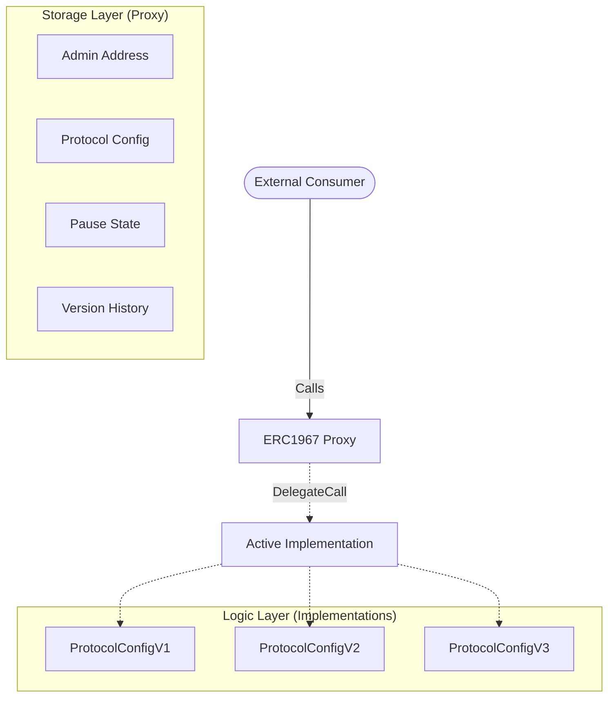

<div align="center">
    
    
    
    
</div>

<br />

<div align="center">
  <h1>UUPS Protocol Configuration System</h1>
  <h3>Production-Grade Upgradeable Smart Contract Architecture</h3>
  <p>
    <i>A reference implementation for secure, storage-safe protocol evolution using the UUPS Proxy Pattern.</i>
  </p>
</div>

<hr />

## 📖 Abstract

This repository contains a **production-grade, upgradeable protocol configuration system** implemented using the **UUPS (Universal Upgradeable Proxy Standard)**.

The system demonstrates a complete, storage-safe upgrade lifecycle across multiple implementation versions (**V1 → V2 → V3**), with explicit handling of:
* **Initialization & Re-initialization**
* **Upgrade Authorization** (Access Control)
* **Storage Layout Preservation**
* **Long-term Configuration Evolution**

The implementation adheres strictly to **OpenZeppelin Upgradeable Contracts (v5)** and is validated through upgrade-aware **Foundry** tests that simulate real-world mainnet fork scenarios.

---

## 🏗 System Architecture

The system utilizes the **ERC1967 Proxy** standard coupled with **UUPS** logic embedded in the implementation. This minimizes gas overhead for users while allowing the logic to be upgraded safely.



### **Architectural Invariants**

1. **Proxy Address Persistence:** The entry point address never changes.
2. **Storage Sovereignty:** All state resides in the Proxy; the implementation is stateless logic.
3. **UUPS Compliance:** Upgrade logic resides in the implementation (`_authorizeUpgrade`).
4. **Append-Only Storage:** Storage slots are never reordered or deleted, ensuring data integrity.

---

## 🔄 Upgrade Lifecycle & Versions

This repository demonstrates a linear evolution of a protocol, handling increasing complexity at each stage.

### **ProtocolConfigV1 — Base Configuration**

* **Purpose:** Establishes the initial protocol state and upgrade boundaries.
* **Capabilities:** Ownership initialization, core fee management.
* **Storage:** `admin`, `feeBps`, `maxLimit`.
* **Key Logic:** Implements the fundamental `UUPSUpgradeable` inheritance.

### **ProtocolConfigV2 — Operational Safety**

* **Purpose:** Introduces emergency controls without wiping V1 state.
* **Upgrade Type:** **Pure Extension** (No re-initialization required).
* **Capabilities:** Pausable functionality (Circuit Breaker).
* **Storage Added:** `bool paused` (Appended safely).

### **ProtocolConfigV3 — Advanced Versioning**

* **Purpose:** Enables historical tracking of configuration changes.
* **Upgrade Type:** **Stateful Upgrade** (Requires `reinitializer(3)`).
* **Capabilities:** Snapshot-based configuration, rollback capability, historical traceability.
* **Storage Added:** Struct-based mappings.

```solidity
// V3 Storage Structure
struct Config {
    uint256 feeBps;
    uint256 maxLimit;
    uint256 activatedAt;
}

```

---

## 💾 Storage Layout Strategy

We strictly adhere to the **Append-Only Storage Pattern** to prevent storage collisions.

| Slot | Variable | Version Introduced | Type |
| --- | --- | --- | --- |
| **0** | `_initialized`, `_initializing` | V1 | `uint8` (OZ Internal) |
| **1** | `owner` | V1 | `address` (Ownable) |
| **...** | ... | ... | ... |
| **50** | `feeBps` | V1 | `uint256` |
| **51** | `maxLimit` | V1 | `uint256` |
| **52** | `paused` | **V2** | `bool` |
| **53** | `activeConfigId` | **V3** | `uint256` |
| **54** | `configCount` | **V3** | `uint256` |
| **55** | `configs` (Mapping) | **V3** | `mapping(uint256 => Config)` |

---

## 🛠️ Technology Stack

* **Language:** [Solidity v0.8.20+](https://soliditylang.org/)
* **Framework:** [Foundry](https://book.getfoundry.sh/) (Forge, Cast, Anvil)
* **Standard Library:** [OpenZeppelin Contracts Upgradeable v5](https://docs.openzeppelin.com/contracts/5.x/upgradeable)
* **Proxy Pattern:** [ERC-1967](https://eips.ethereum.org/EIPS/eip-1967) / [UUPS](https://eips.ethereum.org/EIPS/eip-1822)

---

## 🚀 Getting Started

### Prerequisites

Ensure you have **Foundry** installed:

```bash
curl -L [https://foundry.paradigm.xyz](https://foundry.paradigm.xyz) | bash
foundryup

```

### Installation

```bash
git clone [https://github.com/NexTechArchitect/uups-protocol-config.git](https://github.com/NexTechArchitect/uups-protocol-config.git)
cd uups-protocol-config
forge install

```

### Running Tests

We utilize **Upgrade-Aware Testing**, validating that storage persists correctly after the code changes.

```bash
# Run all tests
forge test

# Run tests with detailed traces
forge test -vvvv

# Generate gas report
forge test --gas-report

```

---

## 🔒 Security Model

### OpenZeppelin v5 Alignment

This system is built on modern OZ patterns:

* **No `upgradeTo**`: We strictly use `upgradeToAndCall` for atomic upgrades + initialization.
* **Namespace Storage**: Prevents collisions between inheritance chains.
* **Access Control**: Upgrades are strictly gated via `onlyOwner` modifiers on the `_authorizeUpgrade` internal function.

### Critical Safety Rules implemented:

1. **Initializer Versioning**: Usage of `initializer` and `reinitializer(N)` prevents re-execution attacks.
2. **Gap Contracts**: Although UUPS is used, storage gaps are considered for future inheritance safety.
3. **Atomic Upgrades**: V3 upgrades are executed with a payload to ensure the new state is configured in the same transaction as the code switch.

---

## 👨‍💻 Author

**NexTechArchitect**

*Smart Contract Engineer & Full-Stack Web3 Developer*

<a href="https://github.com/NexTechArchitect">

</a>
<a href="https://www.linkedin.com/in/amit-kumar-811a11277">

</a>
<a href="https://t.me/NexTechDev">

</a>

---

<div align="center">
<i>Built for longevity. Engineered for safety.</i>
</div>

```

```
