<div align="center">

# 🧬 UUPS Upgradeable Protocol – Foundry

<p align="center">
  <strong>A production-ready, storage-safe implementation of EIP-1822 UUPS Proxies.</strong>
  <br />
  Built with Foundry · Focused on Storage Layout · Real Upgrade Lifecycle
</p>

<br/>
</div>

## 📑 Table of Contents

- [🧠 Overview](#-overview)
- [📚 What is a UUPS Proxy?](#-what-is-a-uups-proxy)
- [⚙️ Why UUPS Standard?](#-why-uups-standard)
- [🏗️ Architecture & Flow](#-architecture--flow)
- [📂 Project Structure](#-project-structure)
- [🧩 Key Components](#-key-components)
  - [The Proxy](#the-proxy)
  - [Implementation Logic](#implementation-logic)
  - [Storage Gaps](#storage-gaps)
- [🚀 Usage & Scripts](#-usage--scripts)
- [🛠️ Tooling & References](#-tooling--references)
- [⚠️ Disclaimer](#-disclaimer)

---

## 🧠 Overview

This repository contains a **from-scratch UUPS (Universal Upgradeable Proxy Standard) implementation** designed to expose how contract upgradability works internally.

The goal is **not just deployment**, but a deep dive into:
- 📦 **Storage Layout** safety and collision prevention.
- 🔐 **Atomic Upgrades** via `upgradeToAndCall`.
- 🔄 **State Preservation** across V1 → V2 → V3 versions.
- ⛽ **Gas Optimization** compared to Transparent Proxies.
- 🔑 **Access Control** for upgrade authorization.

This project mirrors how **large-scale protocols** manage mutable infrastructure on production networks.

---

## 📚 What is a UUPS Proxy?

In traditional Ethereum, smart contracts are immutable. **Upgradeable Proxies** separate the **Storage** (State) from the **Logic** (Code), allowing the logic to be swapped while preserving data.

| Feature | Standard Contract | UUPS Upgradeable Proxy |
| :--- | :--- | :--- |
| **Logic** | Immutable (Forever Fixed) | Swappable (V1 → V2...) |
| **State** | Bound to specific code | Persists in Proxy Address |
| **Gas Cost** | Lower (Direct Call) | Slight Overhead (DelegateCall) |
| **Bug Fixes** | Impossible (Must Redeploy) | Possible (Upgrade Implementation) |

### What does this repo show?
1. Deploying a **V1 Genesis** protocol.
2. Performing a **Pure Logic Upgrade** (V2) adding Pausable functionality.
3. Performing a **Stateful Upgrade** (V3) migrating data structures atomically.

---

## ⚙️ Why UUPS Standard?

UUPS (EIP-1822) is the modern industry standard for upgradability because it is **more gas-efficient** than older Transparent Proxies.

- **Logic in Implementation:** The upgrade mechanism resides in the logic contract, not the proxy.
- **Cheaper Operations:** Removing the `ProxyAdmin` check saves gas on every user transaction.
- **Universal:** Standardized interface compatible with all major tooling (OpenZeppelin, Foundry).

---

## 🏗️ Architecture & Flow

The flow of a transaction follows the `DelegateCall` pattern, where the Proxy borrows the logic of the Implementation but keeps the state in its own storage.

```mermaid
graph LR
    User[User / Client] -->|Calls| Proxy[ERC1967 Proxy]
    Proxy -.->|DelegateCall| V1[Implementation V1]
    Proxy -.->|UpgradeTo| V2[Implementation V2]
    Proxy -.->|UpgradeTo| V3[Implementation V3]
    
    style Proxy fill:#2d1b4e,stroke:#9d4edd,stroke-width:2px
    style V1 fill:#1a1a1a,stroke:#555
    style V2 fill:#1a1a1a,stroke:#555
    style V3 fill:#1a1a1a,stroke:#b298dc

```



---

## 📂 Project Structure

A clean, modular structure following Foundry best practices.

```text
src/
├── proxy/
│   └── ERC1967Proxy.sol        # The permanent storage address
├── implementations/
│   ├── ConfigV1.sol            # Genesis logic (Basic Fee)
│   ├── ConfigV2.sol            # Logic extension (Pausable)
│   └── ConfigV3.sol            # State migration (Structs)
├── interfaces/                 # IUUPS, IConfig
script/
├── DeployUUPS.s.sol            # Initial deployment logic
├── UpgradeToV2.s.sol           # Logic swap script
└── UpgradeToV3.s.sol           # Complex migration script

```

---

## 🧩 Key Components

### The Proxy

The `ERC1967Proxy` is the face of the protocol. It holds:

1. **State Variables:** Balances, configurations, and admin roles.
2. **Implementation Address:** Stored in a specific storage slot (EIP-1967) to avoid collisions with state variables.

### Implementation Logic

The `ConfigV` contracts define *how* the state changes.

* **`_authorizeUpgrade`:** A critical security function. In UUPS, the implementation **must** include this function to allow future upgrades. If removed, the proxy becomes permanently locked.

### Storage Gaps

We utilize `uint256[50] __gap` arrays in our contracts.

* **Purpose:** Reserves storage slots for future library upgrades.
* **Mechanism:** Ensures that adding a new variable in a parent contract doesn't shift the storage layout of child contracts, preventing data corruption.

---

## 🚀 Usage & Scripts

This project uses **Foundry** for all deployments and simulations.

### Prerequisites

* [Foundry](https://github.com/foundry-rs/foundry)
* [Git](https://git-scm.com/)

### Installation

```bash
git clone [https://github.com/NexTechArchitect/uups-protocol-config.git](https://github.com/NexTechArchitect/uups-protocol-config.git)
cd uups-protocol-config
forge install

```

### Build & Test

```bash
forge build
forge test

```

### Deployment & Evolution

We use Solidity scripts to simulate the protocol lifecycle.

| Command | Description |
| --- | --- |
| `make deploy` | Deploys the Proxy pointing to V1 Implementation. |
| `make upgrade-v2` | Upgrades logic to V2 (Adds Pausable). |
| `make upgrade-v3` | Upgrades and re-initializes storage for V3. |

---

## 🛠️ Tooling & References

The following tools and standards were used to build this project:

* **[Foundry](https://book.getfoundry.sh/)**: Blazing fast, portable and modular toolkit for Ethereum application development.
* **[EIP-1822 (UUPS)](https://eips.ethereum.org/EIPS/eip-1822)**: The official Universal Upgradeable Proxy Standard specification.
* **[OpenZeppelin Upgrades](https://www.google.com/search?q=https://docs.openzeppelin.com/upgrades-plugins/1.x/)**: Industry standard libraries for proxy management.
* **[Storage Layout Checks](https://docs.soliditylang.org/en/v0.8.20/internals/layout_in_storage.html)**: Ensuring no collisions occur during upgrades.

---

## ⚠️ Disclaimer

This repository is intended for **educational purposes and architectural exploration**.
While it implements production-grade patterns, upgradeable systems introduce significant complexity. Do not use without a thorough security review and storage layout audit.

---

<div align="center">
<b>Built with ❤️ by NEXTECHARHITECT</b>


<i>Smart Contract Developer · Solidity · Foundry · Web3 Engineering</i>


<a href="https://github.com/NexTechArchitect">GitHub</a> •
<a href="https://www.google.com/search?q=https://twitter.com/NexTechArchitect">Twitter</a>
</div>

```

```
