<div align="center">
  

  <br />

  <a href="https://github.com/NexTechArchitect/uups-protocol-config">
    
    
    
    
  </a>

  <br /><br />

  <h3>🧬 UUPS Protocol Configuration Architecture</h3>
  <p width="80%">
    <b>A production-grade, storage-safe upgradeability framework.</b><br/>
    Demonstrating atomic upgrades, historical state preservation, and gas-optimized logic replacement.
  </p>

</div>

<br />

<div align="center">
  <table>
    <tr>
      <td align="center" width="20%"><a href="#-system-architecture"><b>🏗 Architecture</b></a></td>
      <td align="center" width="20%"><a href="#-data-flow--lifecycle"><b>🔄 Data Flow</b></a></td>
      <td align="center" width="20%"><a href="#-storage-mechanics"><b>🧮 Storage</b></a></td>
      <td align="center" width="20%"><a href="#-security-invariants"><b>🛡 Security</b></a></td>
      <td align="center" width="20%"><a href="#-risk-mitigation"><b>⚠️ Risks</b></a></td>
    </tr>
  </table>
</div>

<hr />

## 🏗 System Architecture

The system implements a **Separation of Concerns (SoC)** pattern: **Storage** is permanent, while **Logic** is ephemeral.

### 🧩 Component Stack
The **Proxy** acts as the storage layer (Hard Drive), while the **Implementation** acts as the logic layer (CPU).

```mermaid
graph TD
    %% Styling
    classDef user fill:#000,stroke:#00E5FF,stroke-width:2px,color:#fff;
    classDef proxy fill:#1a1a1a,stroke:#be5212,stroke-width:2px,color:#fff;
    classDef logic fill:#2d2d2d,stroke:#fff,stroke-width:1px,color:#ccc;
    
    User((👤 User / Admin)):::user
    
    subgraph "Permanent Layer (ERC-1967)"
        Proxy[🏢 UUPS Proxy Contract<br/>(Holds ALL State & Balance)]:::proxy
    end

    subgraph "Logic Layer (Replaceable)"
        V1[📜 Implementation V1<br/>(Basic Logic)]:::logic
        V2[⏸️ Implementation V2<br/>(Pausable Logic)]:::logic
        V3[📚 Implementation V3<br/>(History Logic)]:::logic
    end

    User ==>|1. Calls Function| Proxy
    Proxy -.->|2. DelegateCall| V1
    
    %% Connections for clarity
    V1 -.-> V2
    V2 -.-> V3

```

---

## 🔄 Data Flow & Lifecycle

We use a **Sequence Diagram** to visualize exactly how an upgrade request travels through the system without corrupting data.

### ⚡ Upgrade Sequence

```mermaid
sequenceDiagram
    participant Admin
    participant Proxy as 🏢 Proxy (Storage)
    participant ImplV1 as 📜 Logic V1
    participant ImplV2 as ⏸️ Logic V2

    Note over Proxy: State: feeBps = 500

    Admin->>Proxy: upgradeToAndCall(address V2)
    Proxy->>ImplV1: _authorizeUpgrade()
    Note right of ImplV1: 1. Checks onlyOwner<br/>2. Validates UUPS
    
    ImplV1-->>Proxy: Success
    Proxy->>Proxy: Update Implementation Slot
    
    Note over Proxy: ⚠️ SWITCHING LOGIC...
    
    Proxy->>ImplV2: DelegateCall (Initialize V2)
    ImplV2-->>Proxy: State Updated (paused = false)
    
    Note over Proxy: New State: feeBps=500, paused=false

```



### 📂 Repository Structure

```text
uups-protocol-config/
├── src/
│   ├── ProtocolConfigV1.sol      // Genesis: Ownership & Fees
│   ├── ProtocolConfigV2.sol      // Extension: Emergency Pause
│   ├── ProtocolConfigV3.sol      // Evolution: Historical Structs
│   └── proxy/                    // ERC1967Proxy Implementation
├── script/
│   ├── DeploySystem.s.sol        // Atomic Deployment
│   └── UpgradeToV2.s.sol         // Safe Upgrade Script
└── test/
    ├── unit/                     // Logic Tests
    └── integration/              // Storage Layout Validation

```

---

## 🧮 Storage Mechanics

The safety of the system relies on the **ERC-1967 Storage Slot Standard**. We mathematically derive storage locations to prevent collisions between the Proxy admin logic and the Implementation variables.

### 1. Implementation Slot

The address of the current logic contract is stored at a specific slot to avoid overwriting state variables (like `feeBps`).

### 2. Layout Alignment

We enforce **Append-Only** storage updates. New variables are added to the end of the storage layout.

| Version | Slot 0 | Slot 50 | Slot 51 | Slot 52 |
| --- | --- | --- | --- | --- |
| **V1** | `_initialized` | `feeBps` | `maxLimit` | *(Empty)* |
| **V2** | `_initialized` | `feeBps` | `maxLimit` | `paused` |
| **V3** | `_initialized` | `feeBps` | `maxLimit` | `paused` |

---

## 🛡 Security Invariants

This system is verified using **Foundry Invariant Tests**. The following properties hold true across all upgrade versions.

| ID | Invariant Property | Status |
| --- | --- | --- |
| **INV_01** | **Storage Integrity:** Existing variables (`feeBps`) are never overwritten/corrupted during upgrade. | ✅ **PASS** |
| **INV_02** | **Auth Control:** Only `owner` can call `upgradeToAndCall`. | ✅ **PASS** |
| **INV_03** | **Initialization:** Contract cannot be re-initialized (v1) after deployment. | ✅ **PASS** |
| **INV_04** | **Atomicity:** V3 upgrade and V3 configuration happen in the same transaction. | ✅ **PASS** |

---

<br />

<div align="center">


<h3>Engineered by NexTechArchitect</h3>
<p><i>Protocol Design • DeFi Architecture • Security Engineering</i></p>

<a href="https://github.com/NexTechArchitect">

</a>
&nbsp;&nbsp;
<a href="https://www.linkedin.com/in/amit-kumar-811a11277">

</a>
&nbsp;&nbsp;
<a href="https://t.me/NexTechDev">

</a>
</div>

```

```
